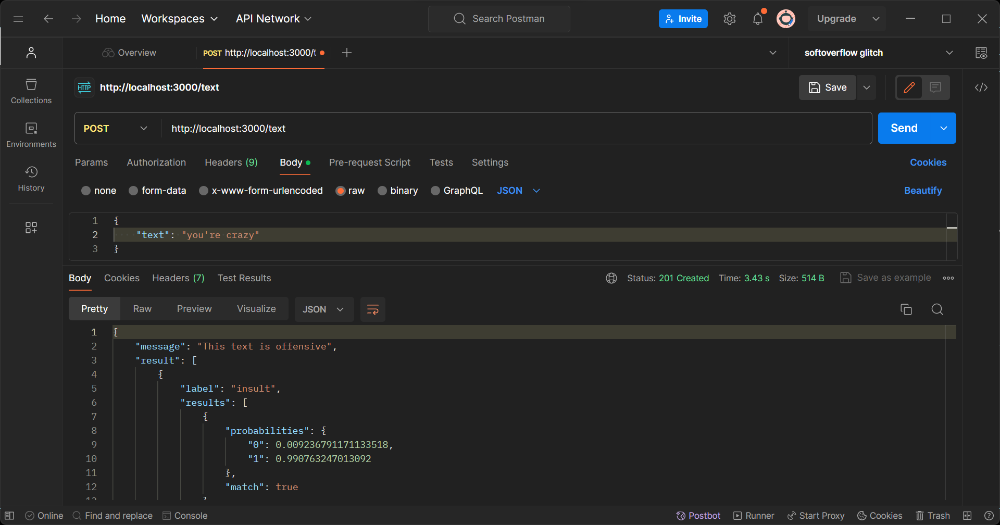

# Text Toxicity Detector API. [GitHub Repo](https://github.com/oyedotunsodiq045/ai-tensorflow-node-toxicity-app).

> Building a Toxicity Classification App in JavaScript with [Node.js](https://nodejs.org/en), [Express](https://expressjs.com/en/starter/generator.html) &amp; [Tensorflow](https://github.com/tensorflow/tfjs-models/tree/master/toxicity)

## Quick Start

```bash
# Install dependencies
$ npx express-generator
$ npm i
$ npm i @tensorflow/tfjs @tensorflow-models/toxicity

# Serve on localhost:3000 (unix: macos/linux)
$ DEBUG=ai-tensorflow-node-toxicity-app:* npm start

# Serve on localhost:3000 (windows command prompt)
> set DEBUG=ai-tensorflow-node-toxicity-app:* & npm start

# Serve on localhost:3000 (windows powershell)
PS> $env:DEBUG='ai-tensorflow-node-toxicity-app:*'; npm start
```

### Testing

| Routes                                                                               | Description                  |
| ------------------------------------------------------------------------------------ | ---------------------------- |
| POST &nbsp; &nbsp; &nbsp; http://localhost:3000/text                                 | Classify text                |

